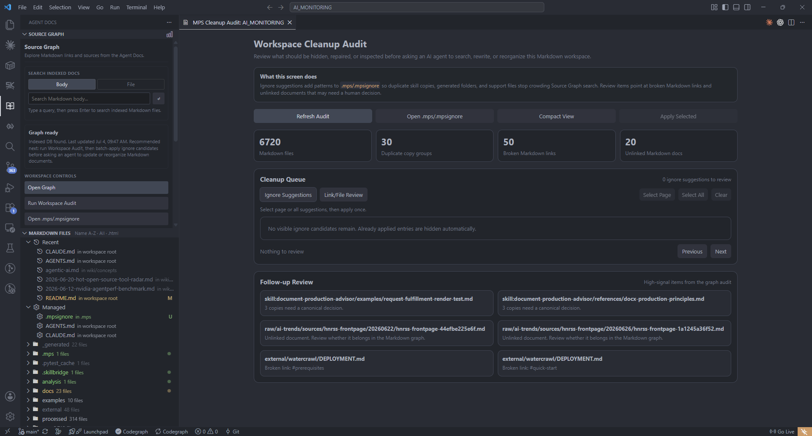

# Agent Docs for Markdown

[](https://marketplace.visualstudio.com/items?itemName=datanewbie-labs.markdown-agent-docs)

Turn a local Markdown folder into an AI-readable document graph.

Agent Docs for Markdown is a VS Code extension for people who keep knowledge in Markdown and want AI agents to use it with evidence. It indexes local Markdown into a Source Graph, helps clean noisy folders before agent work, installs bundled agent skills, and exports polished HTML when the writing is done.

한국어 가이드는 [README.ko.md](README.ko.md)를 참고하세요.  
Extension-specific Marketplace copy lives in [vscode-extension/README.md](vscode-extension/README.md).

Current repository extension version: `0.1.58`.

## What It Does

- Browse Markdown files in a dedicated Agent Docs sidebar.
- Preview and export Markdown as styled standalone HTML, blog paste HTML, or scoped content fragments.
- Build a local `.mps/source-graph.sqlite` index from documents, links, URLs, images, broken links, and related notes.
- Use Source Graph Focus and Hop controls to explore a document neighborhood without losing the larger structure.
- Run Workspace Cleanup Audit before asking an AI agent to search, rewrite, or reorganize a large Markdown corpus.
- Install the bundled `markdown-manager` and `markdown-writer` skills into `.claude/skills`, `.agents/skills`, `.codex/skills`, `.gemini/skills`, or `.cursor/skills`.

## Why It Exists

Most Markdown folders are useful to humans but vague to AI agents. Agents need:

- which document is the canonical source
- which files are linked or unlinked
- which folders are generated noise
- which backlinks and URLs matter
- which context to read before editing

Agent Docs for Markdown gives the agent a local wiki-like source map without forcing you to move out of Markdown.

## Visual Tour

### Source Graph With Focus And Hop


Select a node, press `Focus`, then use `Hop +` from any selected branch node. The existing focus graph stays in place while the selected branch expands outward.

### Workspace Cleanup Audit



Before handing a workspace to an agent, review ignore suggestions, broken links, unlinked docs, and duplicate skill copies. Batch-apply `.mps/.mpsignore` patterns when the noise is clear.

### VS Code Markdown Workflow


The extension keeps file browsing, preview, Source Graph, cleanup, and skill installation inside VS Code.

### Local Web Editor


The GitHub repository also includes a separate local web editor and CLI. This is not packaged into the VS Code extension.

## Install The VS Code Extension

Install from the Visual Studio Marketplace:

[Agent Docs for Markdown](https://marketplace.visualstudio.com/items?itemName=datanewbie-labs.markdown-agent-docs)

Or from VS Code Quick Open:

```text
ext install datanewbie-labs.markdown-agent-docs
```

Recommended first run:

1. Open a Markdown workspace in VS Code.
2. Open the Agent Docs sidebar.
3. Run `Open Graph` or `Agent Docs: Open Source Graph`.
4. Run `Run Workspace Audit` and review cleanup suggestions.
5. Run `Agent Docs: Install or Export Skills`.
6. Ask your agent to use `markdown-manager` for graph/search work or `markdown-writer` for writing/rendering work.

## Built-In Skill Router And What To Ask

Install skills with:

```text
Agent Docs: Install or Export Skills
```

Choose `Install recommended Manager + Writer skills`, then select the target agent folders you use. Missing folders are created automatically. This installs two recommended slash commands: `markdown-manager` for graph/search/cleanup work and `markdown-writer` for reports, decks, polished Markdown, and render checks.

Advanced users can still install individual low-level skills from `Advanced: choose source and target`.

### How To Use The Skills In Chat

After installation, start your AI agent chat with the skill that matches the job:

- Use `/markdown-manager` for workspace search, Source Graph, links, update impact, canonical docs, or `.mpsignore`.
- Use `/markdown-writer` for writing, rewriting, reports, blog-ready Markdown, deck-ready Markdown, visual structure, and HTML render checks.

In plain chat UIs, write `Use markdown-manager` or `Use markdown-writer`.

If you are unsure how to start, ask the agent for guidance first:

```text
Use markdown-manager.

I am new to Agent Docs. Explain how to use Source Graph and the bundled skills in this workspace.
Tell me when to use markdown-manager, when to use markdown-writer, and give me copy-paste prompts.
```

Good starting prompts:

```text
/markdown-manager 이 문서와 연결된 관련 문서까지 찾아서 업데이트 범위를 알려줘.
```

```text
Use markdown-manager.

Find broken links, orphan docs, duplicate generated content, and .mpsignore candidates before I ask an agent to update this workspace.
```

```text
/markdown-writer 이 리서치 노트를 8페이지 임원 보고서 형태의 Markdown으로 재구성하고 렌더 체크까지 해줘.
```

```text
Use markdown-writer to turn @brief.md into a polished Agent Docs report. Keep evidence, improve structure, and include an export-readiness checklist.
```

### Start Here

| Skill | Ask this when you want... | Example prompt |
| --- | --- | --- |
| `markdown-manager` | Markdown search, Source Graph cleanup, links, update impact, context packaging, canonical docs | `Use markdown-manager to inspect this workspace. I want to update wiki/concepts/agentic-ai.md without missing related docs or broken links.` |
| `markdown-writer` | reports, briefs, tutorials, presentation-style Markdown, deck-ready Markdown, export/render checks | `Use markdown-writer to turn @brief.md into a polished Agent Docs report with evidence, better structure, and render QA.` |

### Internal Routes Used By `markdown-manager`

| Route | Ask this when you want... | Example prompt |
| --- | --- | --- |
| `markdown-workspace-search` | evidence-backed answers from local Markdown | `Use markdown-workspace-search to find what this workspace says about NVIDIA agent evaluation. Include paths, headings, backlinks, and next docs to read.` |
| `markdown-graph-triage` | a corpus-level health check | `Use markdown-graph-triage to audit this Markdown workspace. Find entry docs, orphan docs, noisy folders, duplicate skill copies, and weak graph areas.` |
| `markdown-ignore-advisor` | cleaner `.mps/.mpsignore` rules | `Use markdown-ignore-advisor to decide which folders should be excluded from Source Graph before agents work on this repo.` |
| `markdown-context-packager` | the smallest useful reading bundle | `Use markdown-context-packager for the topic "agent runtime reliability". Package the docs, headings, backlinks, URLs, and conflicts an agent should read first.` |
| `markdown-update-planner` | an impact plan before editing | `Use markdown-update-planner before updating wiki/concepts/agentic-ai.md. Tell me which linked or related docs should be reviewed together.` |
| `markdown-canonicalizer` | canonical source decisions | `Use markdown-canonicalizer to choose the canonical Markdown page for "MCP tooling". Identify merge, archive, redirect, or keep-separate candidates.` |
| `markdown-link-repair` | broken links and weak backlinks | `Use markdown-link-repair to find broken internal links and stale URL references. Prioritize the fixes that most affect Source Graph quality.` |
| `markdown-writer` | writing, presentation-style Markdown, deck-ready structure, export readiness, render QA | `Use markdown-writer to convert this research note into an executive report and verify the rendered HTML output.` |
| `install-diagnostics` | missing local tools or setup issues | `Use install-diagnostics to check whether this workspace has the Node, npm, CLI, and environment setup needed for Agent Docs workflows.` |

### A Good Agent Prompt Pattern

```text
Use markdown-manager.

Goal: update wiki/concepts/agentic-ai.md without drifting from related docs.
Return:
- files to read first
- why each file matters
- backlinks and outbound links to check
- update plan
- risks or conflicts
Do not edit until the plan is clear.
```

### A Good Writing Prompt Pattern

```text
Use markdown-writer.

Turn @brief.md into a polished Agent Docs for Markdown report.
Audience: technical leadership
Tone: concise, evidence-led
Output: Markdown only
Include:
- frontmatter with title, theme, intent, and appearance
- clear sections with short headings
- tables or feature grids only where they improve scanning
- final export-readiness checklist
```

## Source Graph Workflow

Source Graph is local-first. It writes a workspace index to:

```text
.mps/source-graph.sqlite
```

Core controls:

- `URLs`: show external URL reference nodes.
- `Images`: show image and asset references.
- `Broken`: show unresolved Markdown links.
- `Groups`: show folder group regions.
- `Focus`: show the selected node and its direct neighbors.
- `Hop +`: expand from the currently selected branch node while keeping the existing focus graph.
- `All`: return to the full graph.
- `Layout`: re-apply layout. In Focus mode, it restores the radial branch layout.

Before agent work, run Workspace Cleanup Audit and review `.mps/.mpsignore` suggestions. This keeps generated folders, bundled skill copies, build output, and raw data from crowding search results.

## HTML Export

Use `Agent Docs: Export Styled HTML` in VS Code.

| Target | Use for |
| --- | --- |
| Complete HTML File | local sharing, archive files, standalone reader |
| Blog Paste HTML | Tistory, WordPress, Velog, and other existing article editors |
| Content Fragment | systems that already provide their own page shell |

The repository CLI exposes the same renderer:

```bash
npm run md2html -- test/notes.md --out test/notes.html --standalone
npm run md2html -- test/notes.md --out test/notes.blog.html --export-target blog-embed
```

## GitHub-Only Local Web Editor

The local web editor is separate from the VS Code extension. Use it when you clone the repository and want browser-based editing, templates, direct CLI testing, or renderer development.

Requirements: Node.js 18+

```bash
git clone https://github.com/sungreong/agent-docs-for-markdown.git
cd agent-docs-for-markdown
npm install
npm start
```

Open:

```text
http://localhost:3188
```

## Development

```bash
npm install
npm run test:source-graph

cd vscode-extension
npm install
npm run build
npm run package:vsix
```

## Documentation Map

- Korean guide: [README.ko.md](README.ko.md)
- VS Code extension README: [vscode-extension/README.md](vscode-extension/README.md)
- Extension guide: [vscode-extension/EXTENSION_GUIDE.md](vscode-extension/EXTENSION_GUIDE.md)
- Release history: [CHANGELOG.md](CHANGELOG.md)
- Source Graph CLI skill QA: [docs/planning/source-graph-cli-skill-qa.md](docs/planning/source-graph-cli-skill-qa.md)
- CLI renderer: [scripts/md-to-html.mjs](scripts/md-to-html.mjs)
- Source Graph CLI: [scripts/source-graph.mjs](scripts/source-graph.mjs)
