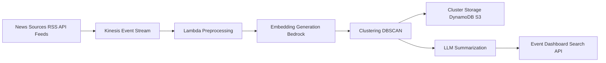
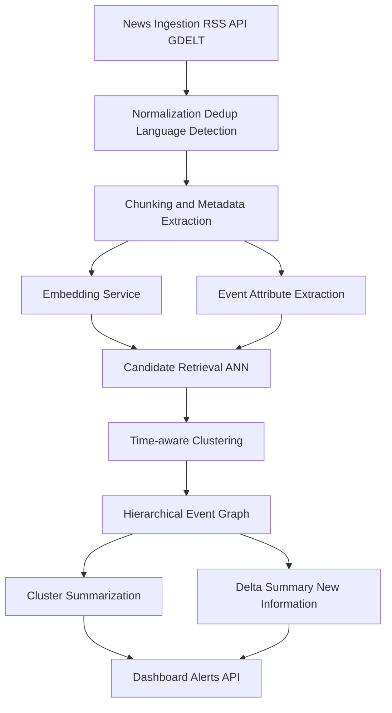
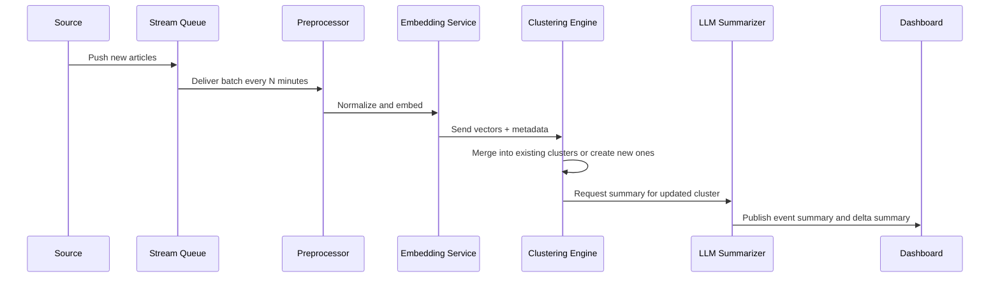
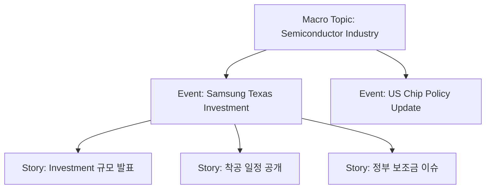

# 실시간 뉴스 클러스터링과 요약 시스템 설계
## AWS 샘플 아키텍처에서 최신 이벤트 중심 뉴스 분석까지

뉴스 모니터링 시스템을 만든다고 하면 보통은 이렇게 생각한다.

1. RSS나 API로 기사를 모은다
2. 텍스트 임베딩을 만든다
3. 비슷한 기사끼리 묶는다
4. 각 묶음을 요약한다

표면적으로는 맞는 말이다.  
하지만 실제로 운영해보면 금방 이상해진다.

같은 사건인데 표현이 달라서 서로 다른 클러스터로 갈라지기도 하고,  
반대로 같은 키워드를 많이 공유해서 전혀 다른 사건이 하나의 클러스터로 합쳐지기도 한다.  
특히 금융, 정책, 기업 리스크 모니터링처럼 속도와 정확도가 모두 중요한 영역에서는 단순 유사도 기반 군집화만으로는 한계가 명확하다.

이 글에서는 AWS가 공개한 **Near Real-time News Clustering and Summarization for FSI** 아키텍처를 출발점으로 삼아,  
현재 뉴스 분석 시스템이 어떤 방향으로 발전하고 있는지 살펴본다.  
그리고 최신 논문 흐름을 반영해 실제로 더 나은 구조를 어떻게 설계할 수 있을지까지 정리한다.

---

## 왜 뉴스 클러스터링은 생각보다 어려운가

문서 분류와 뉴스 이벤트 탐지는 비슷해 보이지만 다르다.

예를 들어 다음 세 기사를 보자.

- 삼성전자, 미국 내 반도체 투자 확대
- 삼성, 텍사스 공장 증설 계획 발표
- 미국 반도체 공급망 강화에 삼성 참여

세 문장은 단어가 조금씩 다르다.  
하지만 사람이 보면 같은 사건이라고 판단할 가능성이 높다.

반대로 다음 두 기사도 비슷한 단어를 쓸 수 있다.

- 미국 금리 인상 전망
- 미국 금리 동결 가능성 확대

둘 다 금리, 미국, 전망 같은 단어를 공유하지만 핵심 메시지는 다를 수 있다.

즉 뉴스 분석은 단순히 문서를 묶는 문제가 아니라,  
**같은 사건을 찾고 그 사건의 전개를 추적하는 문제**에 가깝다.

이 문제는 오래전부터 **Topic Detection and Tracking, TDT** 로 연구되어 왔다.

---

## AWS 샘플은 무엇을 보여주는가

AWS가 공개한 샘플은 금융권 시나리오를 중심으로,  
뉴스를 거의 실시간에 가깝게 수집하고 이벤트별로 묶은 뒤 요약하는 구조를 제안한다.

핵심 파이프라인은 다음과 같이 정리할 수 있다.



이 구조가 좋은 이유는 명확하다.

- 수집과 분석을 분리할 수 있다
- 이벤트 기반으로 확장하기 쉽다
- 임베딩과 요약을 Bedrock으로 관리형 처리할 수 있다
- 요약을 전체 기사에 매번 수행하지 않고 클러스터 단위로 제한할 수 있다

즉, 이 구조는 연구 데모라기보다 **실서비스 PoC에 바로 올릴 수 있는 클라우드형 아키텍처**에 가깝다.

다만 여기서 바로 한 가지 의문이 든다.

정말로 **임베딩 + DBSCAN + 요약** 만으로 운영 품질이 충분할까.

내 생각은 그렇지 않다.  
이 구조는 좋은 출발점이지만, 최신 기술 관점에서는 아직 1세대 구조다.

---

## AWS 구조의 강점과 한계

### 강점

첫째, 실시간성이다.  
뉴스 데이터는 한 번에 몰아서 처리하는 배치보다 짧은 간격의 마이크로 배치가 더 실용적이다.  
AWS 구조는 스트리밍 입력을 기반으로 하기 때문에 이벤트가 급증하는 시점을 빨리 포착할 수 있다.

둘째, 관리형 서비스 중심이다.  
Kinesis, Lambda, Step Functions, Bedrock, DynamoDB 같은 구성은 인프라 운영 부담을 줄인다.

셋째, 비용 통제가 가능하다.  
모든 기사에 대해 긴 요약을 생성하지 않고, 클러스터가 성립된 이후에만 LLM을 호출하는 식으로 비용을 줄일 수 있다.

### 한계

첫째, **시간성 반영이 약하다**.  
텍스트 임베딩만으로는 며칠에 걸쳐 이어지는 연속 이벤트와 순간적으로 폭증한 이벤트를 제대로 구분하기 어렵다.

둘째, **이벤트 속성 추출이 부족하다**.  
기사 본문 전체를 그대로 벡터화하면, 핵심 사건보다 주변 맥락이 더 큰 비중을 차지할 수 있다.

셋째, **단층 클러스터링의 한계**가 있다.  
실제 뉴스는 주제, 사건, 세부 하위 이슈가 계층적으로 존재한다.  
예를 들어 "미국 금리"라는 큰 주제 아래 "연준 발언", "시장 반응", "은행주 하락" 같은 하위 이벤트가 동시에 존재한다.

넷째, **다문서 요약의 어려움**이 있다.  
같은 사건을 다루는 기사라도, 각 매체가 강조하는 포인트가 다르고 때로는 서로 상충하는 내용을 포함한다.  
단순히 공통 내용만 추리면 오히려 중요한 차이를 놓칠 수 있다.

---

## 최신 연구는 무엇을 바꾸고 있는가

최근 연구 흐름을 보면 뉴스 분석은 더 이상 단순 문서 군집화가 아니다.  
크게 네 방향으로 발전하고 있다.

### 1. LLM을 군집화 앞뒤로 넣기

2024년의 *Large Language Model Enhanced Clustering for News Event Detection*은  
뉴스 이벤트 탐지를 위해 LLM 기반 키워드 추출, 임베딩, 사후 이벤트 요약과 라벨링을 결합했다.  
또한 군집 품질을 평가하기 위한 **CSAI**라는 안정성 지표도 제안했다.

핵심은 이거다.

- 군집화 전: 텍스트를 더 잘 표현한다
- 군집화 후: 이벤트 제목과 설명을 자동으로 붙인다
- 평가 단계: 단순 거리 기반 점수가 아니라 군집의 해석 가능성까지 본다

즉 이제는 "비슷한 기사 묶기"에서 멈추지 않고,  
**왜 이 묶음이 하나의 사건인지 설명 가능한 구조**로 가고 있다.

### 2. Topic 중심에서 Event 중심으로 이동

2025년 ACL 논문 *Enhancing Event-centric News Cluster Summarization via Data Sharpening and Localization Insights*는  
문제를 아예 **main event 중심**으로 재정의한다.

이 접근은 특히 중요하다.  
왜냐하면 topic은 넓고 느슨하지만, event는 좁고 구체적이기 때문이다.

예를 들면,

- topic: 반도체 산업
- event: 삼성의 텍사스 공장 투자 발표

운영 시스템에서는 topic보다 event가 훨씬 쓸모 있다.  
실제 알림, 리스크 탐지, 분석 대시보드는 사건 단위로 움직이기 때문이다.

### 3. 계층형 클러스터링

2025년 ACL의 *Hierarchical Level-Wise News Article Clustering via Multilingual Matryoshka Embeddings*는  
다국어 뉴스와 소셜 데이터를 계층적으로 묶는 방법을 제안한다.

이 연구의 시사점은 분명하다.

- 모든 뉴스를 한 번에 flat clustering 하면 품질이 쉽게 무너진다
- 상위 주제, 하위 사건, 세부 스토리로 나눠야 한다
- 특히 다국어 뉴스에서는 계층형 구조가 더 중요하다

실무에서 이건 꽤 크다.  
왜냐하면 실제 뉴스 모니터링은 "전체 산업 이슈"와 "오늘 발생한 개별 사건"을 동시에 봐야 하기 때문이다.

### 4. 다문서 요약에서 차이점까지 요약하기

2024년 NAACL의 *Embrace Divergence for Richer Insights*는  
기존 다문서 뉴스 요약이 공통 정보만 뽑는 데 치우쳐 있다고 지적한다.

이건 뉴스 서비스에서 치명적이다.  
실제 사용자는 "다들 공통으로 말하는 사실"만 알고 싶은 게 아니라,

- 어떤 매체는 무엇을 더 강조하는지
- 새로 추가된 정보가 무엇인지
- 보도 간 관점 차이가 있는지

를 알고 싶어 한다.

즉 미래의 뉴스 요약은  
**공통 요약 + 차이점 요약 + 신규 정보 요약** 구조로 가야 한다.

---

## 최신형 뉴스 분석 시스템은 어떻게 달라져야 하나

내가 보기에는 AWS 구조를 바탕으로 실제 품질을 끌어올리려면 다음과 같이 바뀌어야 한다.



여기서 핵심 차이는 세 가지다.

### 1. Event Attribute Extraction

기사 전체를 벡터화하는 대신, 먼저 다음 속성을 뽑는다.

- 인물
- 기관
- 장소
- 날짜
- 액션
- 수치
- 감성 또는 리스크 시그널

이걸 구조화해두면 군집화 품질이 좋아진다.  
예를 들어 "삼성", "텍사스", "투자", "반도체"가 공통이면 같은 사건일 확률이 높다.

### 2. Time-aware Clustering

뉴스 이벤트는 시간축이 중요하다.  
따라서 임베딩 거리만 보지 말고 시간 가중치를 함께 써야 한다.

예를 들어 다음처럼 생각할 수 있다.

```python
score = semantic_similarity * 0.8 + time_proximity * 0.2
```

혹은 시간 차이가 커질수록 유사도를 할인하는 방식도 가능하다.

```python
adjusted_similarity = cosine_sim * exp(-alpha * time_gap_hours)
```

### 3. Delta Summary

클러스터 전체를 매번 다시 요약하면 비효율적이다.  
대신 새로 들어온 기사만 보고 "무엇이 새로 추가되었는가"를 요약하는 방식이 더 실용적이다.

예를 들어

- 기존 요약: 삼성 투자 발표
- 신규 기사: 투자 규모 30조 원, 착공 시점 공개

이렇게 되면 최종 사용자에게는  
"같은 사건이 계속 보도 중이며, 이번에는 투자 규모와 일정이 추가됨"  
같은 요약이 훨씬 유용하다.

---

## 구현 예시
### 1. 간단한 임베딩 + 시간 가중치 기반 군집 후보 계산

아래 코드는 개념 예시다.

```python
from __future__ import annotations

from dataclasses import dataclass
from datetime import datetime
from math import exp
from typing import List

import numpy as np
from sklearn.metrics.pairwise import cosine_similarity


@dataclass
class NewsArticle:
    article_id: str
    title: str
    content: str
    published_at: datetime
    embedding: np.ndarray


def compute_time_decay(hours_diff: float, alpha: float = 0.03) -> float:
    return exp(-alpha * hours_diff)


def compute_pair_score(
    a: NewsArticle,
    b: NewsArticle,
    semantic_weight: float = 0.85,
    time_weight: float = 0.15,
) -> float:
    sim = float(cosine_similarity([a.embedding], [b.embedding])[0][0])
    hours_diff = abs((a.published_at - b.published_at).total_seconds()) / 3600.0
    time_score = compute_time_decay(hours_diff)
    return semantic_weight * sim + time_weight * time_score


def build_similarity_matrix(articles: List[NewsArticle]) -> np.ndarray:
    n = len(articles)
    matrix = np.zeros((n, n), dtype=float)

    for i in range(n):
        for j in range(i, n):
            if i == j:
                matrix[i, j] = 1.0
            else:
                score = compute_pair_score(articles[i], articles[j])
                matrix[i, j] = score
                matrix[j, i] = score
    return matrix
```

이 방식은 아주 단순하지만,  
텍스트 유사도만 쓰는 것보다 뉴스 사건에 더 가깝게 작동할 수 있다.

---

### 2. 이벤트 속성 추출용 스키마 예시

LLM이나 룰 기반 추출로 다음과 같은 JSON을 만들 수 있다.

```json
{
  "article_id": "news_20260314_001",
  "event_entities": {
    "organizations": ["Samsung Electronics"],
    "locations": ["Texas", "USA"],
    "people": []
  },
  "event_action": "investment expansion",
  "event_topic": "semiconductor manufacturing",
  "event_time": "2026-03-14",
  "risk_tags": ["supply_chain", "capital_expenditure"],
  "numbers": ["30 trillion KRW"]
}
```

이 구조를 저장해두면 나중에

- 이벤트 필터링
- 클러스터 제목 자동 생성
- 리스크 대시보드
- 알림 정책

까지 연결하기 쉬워진다.

---

### 3. LLM 요약 프롬프트 예시

단순 요약 대신 다음처럼 역할을 나누는 편이 낫다.

```text
You are an event analyst for a financial news monitoring system.

Given multiple news articles in the same cluster:
1. Identify the core event in one sentence.
2. Summarize the common facts across sources.
3. List newly added information from the latest article.
4. Highlight disagreements or perspective differences across sources.
5. Return JSON only.

Fields:
- event_title
- event_summary
- new_information
- conflicting_points
- market_implication
```

이 프롬프트의 장점은  
그냥 "요약해줘"가 아니라 실제 운영자에게 필요한 출력을 강제한다는 점이다.

---

## Mermaid로 보는 운영 흐름

### 1. 마이크로배치 처리 흐름



### 2. 계층형 이벤트 구조



이런 구조가 필요한 이유는 명확하다.  
사용자는 늘 같은 레벨의 정보를 원하지 않는다.

- 경영진: 큰 주제 흐름
- 실무자: 사건 단위 요약
- 분석가: 세부 기사 변화

즉 같은 데이터를 보더라도 보는 단위가 다르다.

---

## 운영 환경에서 꼭 고려해야 할 것

### 1. 중복 제거

뉴스는 재송고, 부분 수정, 제목 변경이 많다.  
제목만 비교하면 잘못 걸러진다.  
보통은 다음 조합을 함께 쓴다.

- URL canonicalization
- 제목 유사도
- 본문 앞부분 해시
- 발행 시각 차이

### 2. 클러스터 드리프트

처음엔 하나의 사건이었는데 시간이 지나면서 다른 사건이 섞이는 경우가 있다.  
따라서 오래된 클러스터에 새 기사를 무조건 붙이면 안 된다.

대응 방법

- 시간 윈도우 제한
- 신규 기사에 대한 재평가
- 일정 규모 이상이면 클러스터 split 검토

### 3. 요약의 사실성

LLM은 클러스터에 없는 내용도 그럴듯하게 생성할 수 있다.  
그래서 요약 출력은 반드시 최소한 다음 중 하나가 필요하다.

- source sentence attribution
- quote span linking
- evidence id mapping

즉 "이 요약이 어느 기사에서 왔는지"를 추적할 수 있어야 한다.

### 4. 다국어 문제

글로벌 뉴스는 영어만이 아니다.  
한글, 영어, 일본어, 중국어가 섞이면 임베딩 모델 선택이 중요해진다.  
최근 연구가 multilingual embedding과 hierarchical clustering을 강조하는 이유도 여기에 있다.

---

## 어떤 기술 스택이 현실적인가

실제로 구현한다고 하면 다음 조합이 비교적 현실적이다.

### 수집
- RSS
- GDELT
- News API
- 사내 제휴 뉴스 피드

### 스트리밍
- AWS Kinesis
- Kafka

### 임베딩
- Amazon Bedrock Embeddings
- multilingual embedding model
- sentence-transformers 계열

### 검색 및 후보 생성
- OpenSearch kNN
- pgvector
- Milvus
- Weaviate

### 클러스터링
- DBSCAN
- HDBSCAN
- hierarchical agglomerative clustering
- online clustering variant

### 요약
- long-context LLM
- cluster summary + delta summary 분리
- JSON structured output

---

## 정리

AWS의 뉴스 클러스터링 샘플은 여전히 좋은 출발점이다.  
실시간 수집, 임베딩 기반 군집화, 클러스터 단위 요약이라는 큰 흐름은 지금도 유효하다.

하지만 최신 기술 흐름은 그 위에 다음을 더 요구한다.

- topic이 아니라 event 중심으로 볼 것
- 텍스트만이 아니라 시간과 속성을 함께 볼 것
- flat clustering이 아니라 hierarchical clustering을 고려할 것
- 공통점만 요약하지 말고 차이점과 신규 정보도 요약할 것
- 요약의 근거를 추적할 수 있게 만들 것

결국 미래의 뉴스 분석 시스템은 단순한 문서 처리 파이프라인이 아니라  
**실시간 이벤트 이해 엔진**에 가까워질 것이다.

그리고 그 출발점으로 AWS 샘플은 충분히 가치가 있다.  
다만 그걸 그대로 따라 만드는 것과,  
최신 연구 흐름을 흡수해 운영형 구조로 재해석하는 것은 완전히 다른 일이다.

내가 보기엔 진짜 차별화 포인트는 여기서 갈린다.

- 단순 뉴스 요약 서비스
- 사건 단위 모니터링 시스템
- 시간축까지 이해하는 이벤트 인텔리전스 시스템

당신이 만들 블로그도 이 차이를 드러내면 훨씬 설득력이 생긴다.

---

## 참고문헌

[1] AWS Industries Blog, Near Real-time News Clustering and Summarization for FSI  
[2] aws-samples/news-clustering-and-summarization GitHub Repository  
[3] Adane Nega Tarekegn, Large Language Model Enhanced Clustering for News Event Detection, 2024  
[4] Longyin Zhang, Bowei Zou, AiTi Aw, Enhancing Event-centric News Cluster Summarization via Data Sharpening and Localization Insights, ACL 2025  
[5] Hans William Alexander Hanley, Zakir Durumeric, Hierarchical Level-Wise News Article Clustering via Multilingual Matryoshka Embeddings, ACL 2025  
[6] Kung-Hsiang Huang et al., Embrace Divergence for Richer Insights, NAACL 2024  
[7] Aditi Godbole et al., Leveraging Long-Context Large Language Models for Multi-Document Understanding and Summarization in Enterprise Applications, 2024