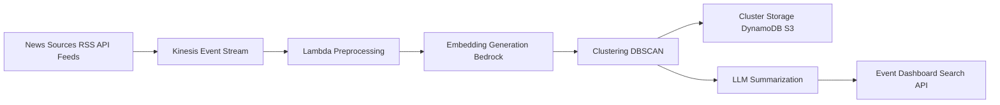
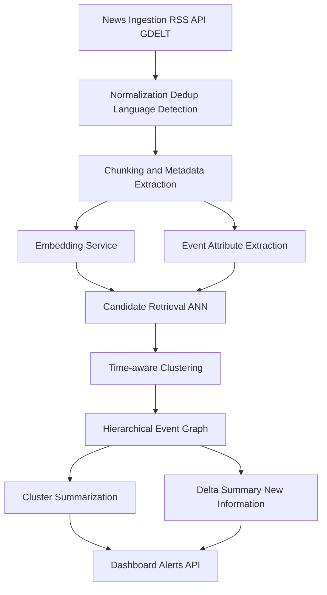
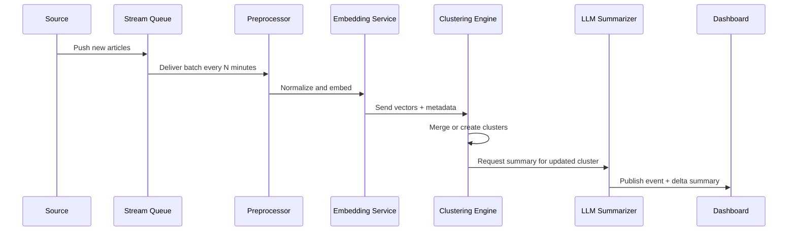
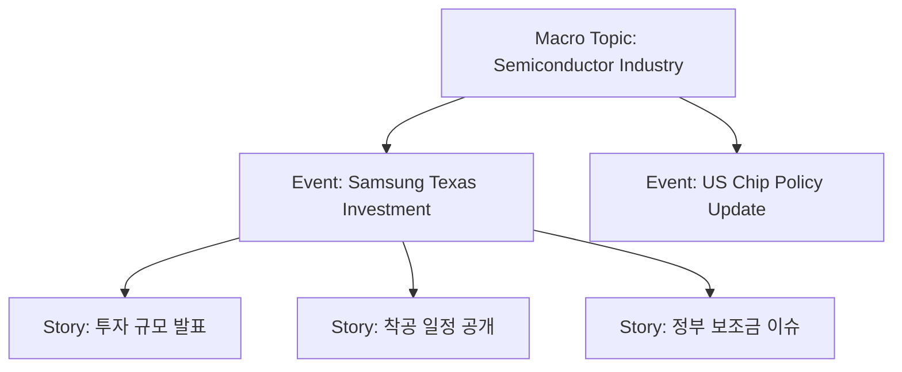

# 실시간 뉴스 클러스터링과 요약 시스템 설계 {#cover .cover eyebrow="Tech Deep Dive · 2026-03-14"}
## AWS 샘플 아키텍처에서 최신 이벤트 중심 뉴스 분석까지

---
{: .page-break}

## 목차 {#agenda .agenda}

1. 왜 뉴스 클러스터링은 어려운가
2. AWS 샘플이 보여주는 것
3. AWS 구조의 강점과 한계
4. 최신 연구 4가지 흐름
5. 최신형 시스템 설계
6. 구현 예시 — 시간 가중치 · 속성 추출 · Delta 요약
7. 운영 흐름 시각화
8. 운영 환경 고려사항
9. 현실적인 기술 스택
10. 정리 및 참고문헌

---
{: .page-break}

## 왜 뉴스 클러스터링은 생각보다 어려운가 {#why-hard .two-column}

### 같은 사건, 다른 표현

뉴스 모니터링 시스템은 보통 이렇게 설계한다.

1. RSS나 API로 기사를 모은다
2. 텍스트 임베딩을 만든다
3. 비슷한 기사끼리 묶는다
4. 각 묶음을 요약한다

아래 세 기사는 단어가 조금씩 다르지만 **같은 사건**이다.

- 삼성전자, 미국 내 반도체 투자 확대
- 삼성, 텍사스 공장 증설 계획 발표
- 미국 반도체 공급망 강화에 삼성 참여

### 다른 사건, 비슷한 단어

표면적으로는 맞는 말이다.
하지만 실제로 운영해보면 금방 이상해진다.

같은 키워드를 공유해도 핵심 메시지는 **반대**일 수 있다.

- 미국 금리 인상 전망
- 미국 금리 동결 가능성 확대

금리·미국·전망을 공유하지만 결론이 다르다.

> [!INFO] 핵심
> 뉴스 분석 = 문서 분류가 아닌 **이벤트 추적 문제**
> 오래전부터 **Topic Detection and Tracking (TDT)** 으로 연구되어 온 난제다.

---
{: .page-break}

## AWS 샘플이 보여주는 것 {#aws-sample}

AWS가 공개한 **Near Real-time News Clustering and Summarization for FSI** 샘플은
금융권 시나리오를 중심으로 실시간 뉴스 수집 → 군집화 → 요약 파이프라인을 제안한다.



> [!INFO] 이 구조의 의미
> 연구 데모라기보다 **실서비스 PoC에 바로 올릴 수 있는 클라우드형 아키텍처**에 가깝다.
> 그러나 최신 기술 관점에서는 아직 **1세대 구조**다.

---
{: .page-break}

## AWS 구조의 강점과 한계 {#aws-pros-cons .two-column}

### 강점

**실시간성**
스트리밍 입력 기반으로 이벤트 급증 시점을 빠르게 포착한다.

**관리형 서비스 중심**
Kinesis · Lambda · Step Functions · Bedrock · DynamoDB로 인프라 운영 부담을 줄인다.

**비용 통제 가능**
클러스터가 성립된 이후에만 LLM을 호출해 요약 비용을 제어한다.

**빠른 PoC**
관리형 서비스 조합으로 빠른 프로토타이핑이 가능하다.

### 한계

**시간성 반영이 약하다**
텍스트 임베딩만으로는 며칠에 걸친 연속 이벤트와 순간 폭증 이벤트를 구분하기 어렵다.

**이벤트 속성 추출이 부족하다**
기사 본문 전체를 벡터화하면 핵심 사건보다 주변 맥락이 더 큰 비중을 차지할 수 있다.

**단층 클러스터링의 한계**
"미국 금리" 아래 "연준 발언", "시장 반응", "은행주 하락" 같은 하위 이벤트가 구분되지 않는다.

**다문서 요약의 어려움**
공통 내용만 추리면 매체 간 관점 차이나 상충 정보를 놓칠 수 있다.

---
{: .page-break}

## 최신 연구는 무엇을 바꾸고 있는가 {#research-trends}

| # | 연구 | 출처 | 핵심 기여 | 변화 포인트 |
|---|---|---|---|---|
| 1 | LLM Enhanced Clustering for News Event Detection | Tarekegn, 2024 | LLM 기반 키워드 추출 + 군집 품질 지표 **CSAI** 제안 | "비슷한 기사 묶기" → **왜 같은 사건인지 설명 가능한 구조** |
| 2 | Event-centric News Cluster Summarization | Zhang et al., ACL 2025 | 문제를 **main event 중심**으로 재정의 + data sharpening | topic(넓고 느슨) → **event(좁고 구체적)** |
| 3 | Hierarchical Level-Wise News Clustering | Hanley et al., ACL 2025 | 다국어 Matryoshka 임베딩 기반 **계층형 클러스터링** | flat clustering → **macro topic / event / story 3단 계층** |
| 4 | Embrace Divergence for Richer Insights | Huang et al., NAACL 2024 | 공통 요약의 한계 지적, **차이점 요약 벤치마크** | 공통 사실 요약 → **공통 + 차이점 + 신규 정보 요약** |

{: .zebra .bordered}

> [!NOTE] 흐름 요약
> 연구 방향은 "클러스터 만들기" → "이벤트 이해하기" → "변화까지 추적하기"로 수렴하고 있다.

---
{: .page-break}

## 최신형 뉴스 분석 시스템은 어떻게 달라져야 하나 {#new-arch}



| 핵심 차이 | AWS 1세대 | 최신형 |
|---|---|---|
| 클러스터링 기준 | 텍스트 임베딩 거리 | 임베딩 + 시간 가중치 + 이벤트 속성 |
| 클러스터 구조 | Flat (단층) | Hierarchical (계층형) |
| 요약 방식 | 전체 요약 | Cluster Summary + Delta Summary 분리 |

{: .zebra .bordered}

---
{: .page-break}

## 구현 예시 1 — 시간 가중치 기반 유사도 {#impl-time}

텍스트 유사도만 쓰는 것보다 뉴스 사건에 더 가깝게 작동하는 개념 예시다.

```python
from __future__ import annotations

from dataclasses import dataclass
from datetime import datetime
from math import exp
from typing import List

import numpy as np
from sklearn.metrics.pairwise import cosine_similarity


@dataclass
class NewsArticle:
    article_id: str
    title: str
    content: str
    published_at: datetime
    embedding: np.ndarray


def compute_time_decay(hours_diff: float, alpha: float = 0.03) -> float:
    return exp(-alpha * hours_diff)


def compute_pair_score(
    a: NewsArticle,
    b: NewsArticle,
    semantic_weight: float = 0.85,
    time_weight: float = 0.15,
) -> float:
    sim = float(cosine_similarity([a.embedding], [b.embedding])[0][0])
    hours_diff = abs((a.published_at - b.published_at).total_seconds()) / 3600.0
    time_score = compute_time_decay(hours_diff)
    return semantic_weight * sim + time_weight * time_score


def build_similarity_matrix(articles: List[NewsArticle]) -> np.ndarray:
    n = len(articles)
    matrix = np.zeros((n, n), dtype=float)
    for i in range(n):
        for j in range(i, n):
            if i == j:
                matrix[i, j] = 1.0
            else:
                score = compute_pair_score(articles[i], articles[j])
                matrix[i, j] = score
                matrix[j, i] = score
    return matrix
```
{: maxHeight="320px"}

시간 감쇠 수식: `adjusted_similarity = cosine_sim × exp(−α × time_gap_hours)`

---
{: .page-break}

## 구현 예시 2 — 이벤트 속성 스키마 & LLM 요약 프롬프트 {#impl-schema .two-column}

### 이벤트 속성 추출 스키마

LLM 또는 룰 기반으로 다음 JSON을 생성한다.
이 구조를 저장해두면 이벤트 필터링 · 클러스터 제목 자동 생성 · 리스크 대시보드 · 알림 정책까지 연결하기 쉬워진다.

```json
{
  "article_id": "news_20260314_001",
  "event_entities": {
    "organizations": ["Samsung Electronics"],
    "locations": ["Texas", "USA"],
    "people": []
  },
  "event_action": "investment expansion",
  "event_topic": "semiconductor manufacturing",
  "event_time": "2026-03-14",
  "risk_tags": ["supply_chain", "capital_expenditure"],
  "numbers": ["30 trillion KRW"]
}
```

### LLM 요약 프롬프트 구조

"요약해줘" 대신 실제 운영자에게 필요한 출력을 강제한다.

```text
You are an event analyst for a financial news monitoring system.

Given multiple news articles in the same cluster:
1. Identify the core event in one sentence.
2. Summarize the common facts across sources.
3. List newly added information from the latest article.
4. Highlight disagreements or perspective differences.
5. Return JSON only.

Fields:
- event_title
- event_summary
- new_information
- conflicting_points
- market_implication
```

---
{: .page-break}

## 운영 흐름 시각화 {#ops-flow .two-column}

### 마이크로배치 처리 흐름



### 계층형 이벤트 구조



같은 데이터를 보더라도 보는 단위가 다르다.

- **경영진**: 큰 주제 흐름
- **실무자**: 사건 단위 요약
- **분석가**: 세부 기사 변화

---
{: .page-break}

## 운영 환경에서 꼭 고려해야 할 것 {#ops-concerns .two-column}

### 중복 제거 & 클러스터 드리프트

**중복 제거**
뉴스는 재송고·부분 수정·제목 변경이 많다.
다음 조합을 함께 사용한다.

- URL canonicalization
- 제목 유사도
- 본문 앞부분 해시
- 발행 시각 차이

**클러스터 드리프트**
처음엔 하나의 사건이었는데 시간이 지나면서 다른 사건이 섞인다.
오래된 클러스터에 새 기사를 무조건 붙이면 안 된다.

- 시간 윈도우 제한
- 신규 기사에 대한 재평가
- 일정 규모 이상이면 클러스터 split 검토

### 요약 사실성 & 다국어 문제

**요약의 사실성**
LLM은 클러스터에 없는 내용도 그럴듯하게 생성할 수 있다.
"이 요약이 어느 기사에서 왔는지"를 추적할 수 있어야 한다.

- source sentence attribution
- quote span linking
- evidence id mapping

**다국어 문제**
글로벌 뉴스는 한글·영어·일본어·중국어가 섞인다.
임베딩 모델 선택이 중요하며, 최근 연구가 multilingual embedding과 hierarchical clustering을 강조하는 이유도 여기에 있다.

---
{: .page-break}

## 어떤 기술 스택이 현실적인가 {#tech-stack}

| 레이어 | 도구 선택지 | 비고 |
|---|---|---|
| 수집 | RSS · GDELT · News API · 제휴 뉴스 피드 | 다채널 통합 권장 |
| 스트리밍 | AWS Kinesis · Kafka | 처리량 규모에 따라 선택 |
| 임베딩 | Amazon Bedrock · multilingual model · sentence-transformers | 다국어 뉴스 시 multilingual 필수 |
| 검색/후보 생성 | OpenSearch kNN · pgvector · Milvus · Weaviate | ANN 기반 후보 축소로 속도 확보 |
| 클러스터링 | DBSCAN · HDBSCAN · hierarchical agglomerative · online variant | 계층형 + 온라인 방식 병행 권장 |
| 요약 | long-context LLM + cluster/delta 분리 + JSON structured output | 근거 추적 가능한 출력 구조 필수 |

{: .zebra .bordered .compact}

---
{: .page-break}

## 정리 {#summary .message}

AWS의 뉴스 클러스터링 샘플은 여전히 좋은 출발점이다.
하지만 최신 기술 흐름은 그 위에 다음을 더 요구한다.

> [!INFO] 핵심 전환 방향
> - topic이 아니라 **event** 중심으로 볼 것
> - 텍스트만이 아니라 **시간과 속성**을 함께 볼 것
> - flat이 아니라 **hierarchical clustering**을 고려할 것
> - 공통점만이 아니라 **차이점과 신규 정보**도 요약할 것
> - 요약의 **근거를 추적**할 수 있게 만들 것

미래의 뉴스 분석 시스템은 단순한 문서 처리 파이프라인이 아니라 **실시간 이벤트 이해 엔진**에 가까워질 것이다.

| 수준 | 시스템 성격 |
|---|---|
| 1단계 | 단순 뉴스 요약 서비스 |
| 2단계 | 사건 단위 모니터링 시스템 |
| 3단계 | 시간축까지 이해하는 이벤트 인텔리전스 시스템 |

{: .zebra .bordered}

---
{: .page-break}

## 참고문헌 {#references}

| # | 저자 | 제목 | 출처 | 연도 |
|---|---|---|---|---|
| 1 | AWS Industries Blog | Near Real-time News Clustering and Summarization for FSI | AWS Blog | — |
| 2 | aws-samples | news-clustering-and-summarization | GitHub Repository | — |
| 3 | Adane Nega Tarekegn | Large Language Model Enhanced Clustering for News Event Detection | arXiv | 2024 |
| 4 | Longyin Zhang, Bowei Zou, AiTi Aw | Enhancing Event-centric News Cluster Summarization via Data Sharpening and Localization Insights | ACL | 2025 |
| 5 | Hans W. A. Hanley, Zakir Durumeric | Hierarchical Level-Wise News Article Clustering via Multilingual Matryoshka Embeddings | ACL | 2025 |
| 6 | Kung-Hsiang Huang et al. | Embrace Divergence for Richer Insights | NAACL | 2024 |
| 7 | Aditi Godbole et al. | Leveraging Long-Context LLMs for Multi-Document Understanding and Summarization in Enterprise Applications | — | 2024 |

{: .zebra .bordered}
