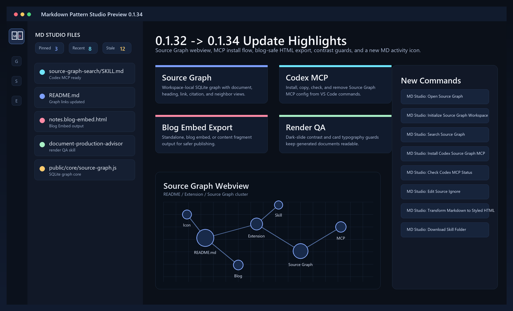
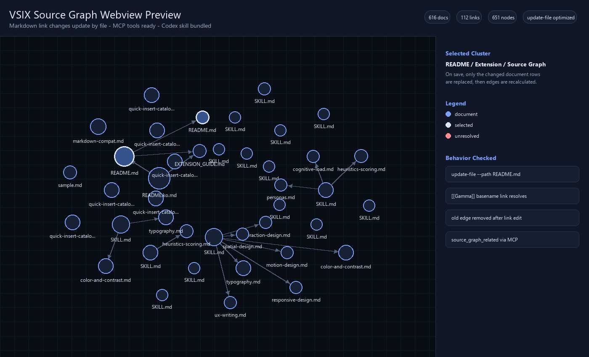

# Agent Docs for Markdown

[Install from the VS Code Marketplace](https://marketplace.visualstudio.com/items?itemName=datanewbie-labs.markdown-agent-docs)

Browse Markdown as a source graph, package context, and write better docs with AI agent skills. The extension also previews and exports Markdown through the bundled CLI.

## 0.1.34 Update Preview



The current VSIX builds on `0.1.32` with a Source Graph workspace, agent-skill setup, blog-safe HTML export targets, stronger render-quality guards, and a single Agent Docs icon for the Activity Bar.

## Source Graph Preview



The Source Graph webview indexes local Markdown into a workspace SQLite graph so documents, headings, links, citations, and related neighbors can be explored visually.

## Features

- `Agent Docs: Preview` command
- `Agent Docs: Refresh Preview` command
- Single Agent Docs Activity Bar icon with file browsing and Source Graph views
- `Agent Docs: Open in Viewer` command safely opens the selected tree item or the active markdown document
- `Agent Docs: Export Styled HTML` command (export the currently open `.md` to styled `.html`)
- `Agent Docs: Install or Export Skills` command installs bundled skills into matching workspace agent folders, exports skills as ZIP files, or opens advanced source/target update options
- Bundled skills include `md-presentation-composer`, `md-to-deck-designer`, `document-production-advisor`, `markdown-workspace-search`, `markdown-graph-triage`, `markdown-ignore-advisor`, `markdown-context-packager`, `markdown-update-planner`, `markdown-canonicalizer`, and `markdown-link-repair`
- `Agent Docs: Initialize Source Graph` creates a workspace-local `.mps/source-graph.sqlite` document graph DB
- `Agent Docs: Edit Source Ignore` opens `.mps/.mpsignore` so noisy folders can be excluded from both the graph and file browser
- The Source Graph launcher sits above the file tree in the Agent Docs sidebar so setup and audit controls stay visible
- The Source Graph launcher stays lightweight and opens a dedicated `Workspace Cleanup Audit` webview for ignore suggestions, broken-link review, unlinked docs, pagination, compact scanning, and batch apply
- The bundled Source Graph CLI also exposes `node scripts/source-graph.mjs audit --root .` so agents can diagnose ignore candidates, duplicate skill copies, orphan docs, and unresolved internal links before editing or analyzing Markdown documents
- The Markdown workspace search skill is installed through `Agent Docs: Install or Export Skills` -> `Install bundled skills to this workspace`
- `FOCUS` command on a folder narrows only the Agent Docs File Browser to that folder
- `Agent Docs: Clear Folder Focus` restores the Agent Docs File Browser view and cleans up legacy Explorer exclude rules if an older build added them
- `Agent Docs: File Extensions` adds non-markdown file types such as `.txt`, `.html`, or `.json` to the browser
- Exported `.html` / `.htm` files open directly in the Agent Docs Viewer when clicked in the file browser
- HTML previews keep the standard viewer actions: Edit Source opens the original HTML file, Refresh reloads it, and save auto-refresh works while the preview is open
- Document expression utilities add ready-to-use classes such as `.safe-zone`, `.problem-statement`, `.big-number-hero`, `.feature-grid`, `.metrics-dashboard`, `.contrast-pair`, `.gradient-number`, `.oversized`, and `.screenshot-shadow`
- `Open in Editor` opens any Agent Docs File Browser item directly in the normal VS Code editor
- Viewer `Style` controls switch between Default, Clean, Flat, Reader, and Print appearances in preview and exported HTML
- CLI/frontmatter appearance options adjust background, corner radius, frame density, and viewer chrome
- Auto refresh on markdown save (`markdownAgentDocs.autoOnSave`)
- Outline collapsed/expanded state is remembered per document
- File URI rewrite (`file://...`) to webview-safe resource URIs
- **Preview works outside the current workspace** — any `.md` file can be previewed using the bundled CLI
- **Responsive viewer** — Slide/Stack layout, outline, and zoom controls adapt to the webview panel size
- **5% zoom controls** — Slide and Stack previews use 5% zoom steps, and Fit can grow beyond 100% when there is room
- Standalone CLI exports embed local images by default, so generated HTML can be moved without losing relative-path images. Add `--no-embed-local-images` to `markdownAgentDocs.extraArgs` to keep file-based image links.
- **Blog Embed HTML export** — choose a copy/paste-safe scoped fragment for Tistory, WordPress, Velog, and other existing site containers where standalone fixed controls would collide with the page UI.

## Recent Changes

0.1.34:

- Improved dark/accent slide contrast so muted context, body copy, links, and inline code remain readable on dark backgrounds.
- Added a color/font contrast harness to bundled document-writing skills so rendered artifacts are reviewed and revised after generation.
- Added a regression guard for `.message .dark` and plain `.dark` slide contrast.

0.1.33:

- Improved card and feature-grid typography in the VS Code webview so card labels stay readable instead of splitting into letter fragments.
- Made column/card grids responsive in narrow preview panels.
- Updated bundled document-writing skills to use short card labels plus body text for safer rendered documents.

0.1.32:

- Added Source Graph workspace initialization, graph search, and agent-skill setup commands.
- Added `.mpsignore` support for graph/file-browser exclusion patterns.
- Added bundled Codex `markdown-workspace-search` skill export/update support for document discovery workflows.
- Added export target selection to `Agent Docs: Export Styled HTML`: Standalone HTML, Blog Embed HTML, and Content Fragment.
- Added Blog Embed output for existing site editors. It scopes CSS under `.mps-embed-root`, removes fixed viewer chrome, and keeps paginated content readable as a stacked article layout in narrow containers.
- Added CLI support for `--export-target standalone|blog-embed|fragment`.
- Changed Agent Docs File Browser prompts and metadata to English by default, with `markdownAgentDocs.language` available for Korean labels.
- Open `.html` and `.htm` files from the Agent Docs File Browser in the Viewer instead of showing a markdown-only error.
- Kept existing preview actions working for HTML files: Edit Source, Refresh, and save-triggered preview updates.
- Fixed Webview toolbar Edit Source fallback so Markdown and HTML previews open their original source file instead of showing a file-selection error.
- Added slide/banner-inspired expression utility classes for safer composition, feature grids, KPI dashboards, contrast pairs, large numbers, and screenshot emphasis.
- Added bundled `document-production-advisor` skill for request-contract tracing, render UX verification, and HTML/blog/DOCX/PPTX-style handoff planning, installable or exportable through `Agent Docs: Install or Export Skills`.

Compared from the pre-browser-upgrade point (`db030df`) to the current extension:

- Added file browser sorting by name, modified time, created time, file size, and document line count
- Added filter modes for all files, Pinned, Recent, stale documents, long documents, and large files
- Added compact localized metadata in the tree, with detailed title/date/size/line-count tooltips
- Added Pinned and Recent virtual sections at the top of the browser
- Added workspace-scoped hidden files/folders with `Hide from Browser` and `Manage Hidden Items`
- Added Agent Docs File Browser folder focus: right-click a browser folder and run `FOCUS` to hide everything outside that folder inside the extension view only
- Added configurable extra file extensions so the browser can include `.txt`, `.html`, `.json`, or other project-local companion files
- Added `Open in Editor` for markdown and non-markdown browser items
- Added viewer appearance options for cleaner, flatter, reader-friendly, and print-oriented HTML
- Added file/folder path, relative path, and name copy commands in the browser context menu
- Added folder summaries and best-effort Git status badges
- Improved responsive preview behavior for narrow webview panels
- Improved Slide and Stack zoom: 5% step controls and Fit values above 100% when space allows
- Split browser, TreeItem, Git status, runtime, and webview helper code into smaller modules so the main source files stay under 1000 lines

### Agent Docs (Activity Bar)

A dedicated sidebar for navigating markdown files as a reader:

- **Agent Docs icon** in the Activity Bar opens the file browser and Source Graph views together
- **Agent Docs Files** lists all `*.md` files in the workspace as a folder tree
- **Click** a file → opens it in the preview panel (single reader panel, previous panel closes)
- **Right-click → Open in New Panel** → opens in a new panel while keeping existing ones open
- **Command Palette → Agent Docs: Open in Viewer** → opens the active markdown file, or shows a clear message when no markdown target is available
- **Search icon** (🔍) in the sidebar title bar → QuickPick search by filename and path
- **Filter icon** → show all files, Pinned, Recent, stale documents, long documents, or large files
- **Sort icon** → sort by name, modified time, created time, file size, or line count
- **Eye icon** → manage hidden files and folders
- **Download icon** in the Agent Docs Files title bar → choose a bundled/workspace skill source, then save a ZIP, update the matching workspace skill root, or apply to all known agent skill folders
- **Right-click → Pin to Top / Unpin** → keep important documents in the Pinned section
- **Right-click → Hide from Browser** → hide low-signal files or folders without changing the filesystem
- **File Extensions icon** in the sidebar title bar → add non-markdown file types to the browser
- **Right-click a folder → FOCUS** → narrow only the Agent Docs File Browser to that folder
- **Click a Markdown or HTML file** → open it in the Agent Docs Viewer
- **Right-click → Open in Editor** → open the selected browser item in the normal VS Code editor
- **Right-click → Copy Path / Copy Relative Path / Copy Name** → copy file or folder references
- **Pinned** and **Recent** sections stay above the normal folder tree
- Folder descriptions summarize document count, recent documents, and stale documents
- **Collapse All** button to reset the folder tree
- Tree auto-refreshes when `.md` files are added, changed, or deleted (300 ms debounce)
- Sidebar selection syncs automatically when the preview changes via `Ctrl+S`

### Skill Install / Export

Use `Agent Docs: Install or Export Skills` from the Command Palette or Agent Docs File Browser sidebar title bar.

1. Choose `Install bundled skills to this workspace` for the normal setup flow. The extension copies each bundled source into its matching workspace target: Bundled Claude -> `.claude/skills`, Bundled Agents -> `.agents/skills`, Bundled Codex -> `.codex/skills`.
2. Choose `Export one skill as ZIP` when you want a portable archive for manual installation in another tool.
3. Choose `Advanced: choose source and target` only when you need to update one selected skill, update every skill from one source, or pick a custom workspace skill root.
4. Missing target folders are created automatically before the skill files are copied.
5. If saving a ZIP, choose a skill folder that contains `SKILL.md`, then save the generated archive. The archive keeps the skill folder as the root, so it extracts as `md-presentation-composer/SKILL.md` plus its references.
6. For custom targets, choose a skill root folder such as `.claude/skills`, not an individual skill folder such as `.claude/skills/md-presentation-composer`.
7. For `document-production-advisor`, open `examples/request-fulfillment-render-test.md` in VS Code and run `Agent Docs: Preview` to test DOCX/PPTX-style structure, mobile stacking, tables, and blog-safe expression classes inside the extension.

### Source Graph And Skill

Use this when a workspace has many Markdown documents and you want graph navigation, related-source search, or agent answers grounded in local document evidence.

1. Open the Markdown workspace in VS Code.
2. Open the `Source Graph` launcher at the top of the Agent Docs sidebar.
3. Use `Start Graph` when you want the guided setup flow. Start Graph will build the first index, open `.mps/.mpsignore`, and then show ignore suggestions so you can clean the corpus immediately.
4. Use `Run Workspace Audit` when you want to refresh the corpus review later. The launcher opens `Workspace Cleanup Audit`, where you can review ignore suggestions, broken Markdown links, and unlinked docs before asking an agent to work on the corpus. Select useful ignore suggestions and use `Apply Selected` to append them to `.mps/.mpsignore`.
5. Run `Agent Docs: Install or Export Skills`, then choose `Install bundled skills to this workspace`.
6. Confirm `markdown-workspace-search` appears under the matching workspace skill roots such as `.codex/skills`, `.agents/skills`, or `.claude/skills`.
7. In Codex, ask it to use the `markdown-workspace-search` skill for a document question. The skill should run `node scripts/source-graph.mjs search --root . --query "README" --limit 3 --include-links --links-depth 1 --include-headings`.
8. For Markdown graph maintenance, ask for `markdown-graph-triage` or `markdown-ignore-advisor` first. They should run `node scripts/source-graph.mjs audit --root .` before proposing `.mpsignore` changes or canonical-source work.
9. Ask for `Path`, `Title`, `Why it matters`, `Heading evidence`, `Link evidence`, and `Next action` so the answer proves it used graph evidence.

Use the Markdown graph skills by intent:

| Skill | Use when |
| --- | --- |
| `markdown-workspace-search` | Answer document questions with Markdown source, heading, backlink, citation, and related-note evidence. |
| `markdown-graph-triage` | Review the whole corpus for entry docs, orphan docs, noisy folders, duplicate skill copies, and weak graph structure. |
| `markdown-ignore-advisor` | Decide what `.mpsignore` should exclude before search or agent work. |
| `markdown-context-packager` | Package the smallest useful set of related docs for a topic, URL, or target document. |
| `markdown-update-planner` | Plan which linked, related, or backlink documents should be reviewed when one document changes. |
| `markdown-canonicalizer` | Choose a primary Markdown source when several pages overlap. |
| `markdown-link-repair` | Prioritize broken internal links, stale URL references, backlink gaps, and graph-quality fixes. |

The DB is workspace-local, similar to a project init command. `Open Source Graph`, `Update Source Graph Index`, `Initialize Source Graph Workspace`, and the sidebar `Run Workspace Audit` flow all refresh or create it. The launcher keeps `.mps/.mpsignore` nearby, while Workspace Cleanup Audit handles dense candidate review with pagination and batch apply. Saving an existing Markdown file updates that document's graph rows; creating or deleting a Markdown file triggers a full rebuild.

Use `Agent Docs: Edit Source Ignore` to create `.mps/.mpsignore` in the workspace control folder. Patterns such as `.codex/**`, `.agents/**`, `.claude/**`, `.gemini/**`, `ai_skills/**`, `vscode-extension/ai_skills/**`, `test/**`, `raw/**`, `**/drafts/**`, or `*.draft.md` are excluded from both Source Graph and the Agent Docs File Browser. The canonical ignore file is `.mps/.mpsignore`; root `.mpsignore` is not used as a fallback.

CLI `search` and `related` collapse duplicate skill copies by default so agent answers are less noisy. Use `--include-copies` only when auditing whether workspace and bundled skill folders are synced.

### Folder Focus

Use `FOCUS` from a folder in the Agent Docs File Browser sidebar.

1. Right-click a folder.
2. Choose `FOCUS`.
3. The Agent Docs File Browser shows only configured files under that folder.
4. Run `Agent Docs: Clear Folder Focus` to return to the normal browser tree.

FOCUS does not modify VS Code Explorer or workspace `files.exclude`. `Clear Folder Focus` also removes legacy exclude rules that were recorded by older experimental builds.

### Viewer Appearance

Use the `Style` menu in the VS Code preview or exported standalone HTML to change document density without changing markdown content.

- Presets: `Default`, `Clean`, `Flat`, `Reader`, `Print`
- Detail controls: background, corners, frame, and viewer chrome
- VS Code preview remembers the last selected appearance and applies it to future previews and `Agent Docs: Export Styled HTML`
- CLI options: `--appearance`, `--appearance-background`, `--appearance-radius`, `--appearance-frame`, `--viewer-chrome`
- Frontmatter keys: `appearance`, `appearanceBackground`, `appearanceRadius`, `appearanceFrame`, `viewerChrome`

### HTML Export Targets

`Agent Docs: Export Styled HTML` asks where the exported HTML will be used:

- **Complete HTML File**: use this when you want a finished file to open locally, share, or archive. It includes the full viewer with Style, Outline, Slide/Stack, and zoom controls.
- **Blog Paste HTML**: use this when you want to paste the result into Tistory, WordPress, Velog, or another article editor. This mode avoids `html/body`, scopes CSS, removes fixed viewer chrome, and stacks paginated slides for mobile readability.
- **Content Fragment**: use this when another system only needs the rendered document body. It outputs scoped document HTML without viewer controls or scripts.

The same behavior is available from the bundled CLI with:

```bash
node scripts/md-to-html.mjs input.md --export-target blog-embed --out input.blog-embed.html
```

### In-Reader Text Search

- Press `Ctrl+F` inside the preview webview to open a floating search bar
- Matches are highlighted in real time as you type
- `↑` / `↓` buttons (or `Shift+Enter` / `Enter`) to cycle through results with match count
- `Escape` closes the bar and clears highlights

## Settings

- `markdownAgentDocs.autoOnSave` (default: `true`)
- `markdownAgentDocs.cursorSyncOnSave` (default: `true`)
- `markdownAgentDocs.nodePath` (default: `"node"`)
- `markdownAgentDocs.cliScriptPath` (default: `"scripts/md-to-html.mjs"`)
- `markdownAgentDocs.preferredViewMode` (default: `"stack"`, values: `"auto" | "slides" | "stack"`)
- `markdownAgentDocs.language` (default: `"en"`, values: `"en" | "ko"`)
- `markdownAgentDocs.extraArgs` (default: `["--standalone"]`)

Default behavior:

1. Try `markdownAgentDocs.cliScriptPath` in current workspace context.
2. If the setting is default (`scripts/md-to-html.mjs`) and missing, automatically fallback to bundled CLI inside the extension.
3. If still missing, show `Select Script` picker and save selected path to user settings.
4. If `markdownAgentDocs.cliScriptPath` is explicitly customized, that path is prioritized (no automatic bundled fallback override).
5. **Outside workspace**: bundled CLI is used automatically. Set `markdownAgentDocs.cliScriptPath` to an absolute path to override.
6. View mode: default `preferredViewMode=stack` matches the web editor, and `auto` switches to Stack on narrow webview panels.
7. Slide and Stack Fit calculate against the current webview size and can exceed 100% when there is room.
8. Outline panel remembers the last collapsed/expanded state for each markdown document.
9. Cursor-sync parser also falls back to bundled `public/core/engine.js` when workspace parser is missing.

## Cursor Sync on Save

When `markdownAgentDocs.cursorSyncOnSave` is enabled, pressing `Ctrl+S` will:

1. Render markdown via CLI
2. Resolve current cursor section
3. Move preview to that section (outline-first navigation)

For full operations and troubleshooting, see `EXTENSION_GUIDE.md` in this folder.

## Development

```bash
npm install
npm run build
```

## Package VSIX

```bash
npm run package:vsix
```

Then install:

```bash
code --install-extension .\markdown-agent-docs-0.1.41.vsix
```
