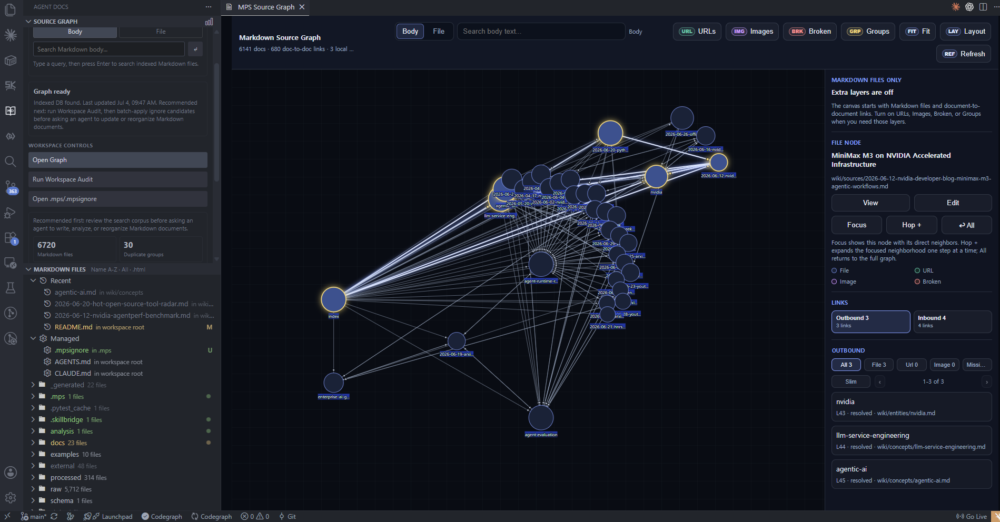

# Agent Docs for Markdown

[Install from the VS Code Marketplace](https://marketplace.visualstudio.com/items?itemName=datanewbie-labs.markdown-agent-docs)

Turn a Markdown workspace into an AI-readable source graph.

Agent Docs for Markdown is a VS Code extension for local Markdown knowledge bases. It gives you a document browser, styled preview/export, Source Graph navigation, Workspace Cleanup Audit, and bundled AI-agent skills that help Claude, Codex, Agents, Gemini, or Cursor work from grounded Markdown evidence.

## Source Graph Focus And Hop



Use Source Graph when the workspace is too large for manual search.

- `Focus` shows the selected document and its direct neighbors.
- `Hop +` expands from the currently selected branch node while keeping the existing focus graph.
- `All` returns to the full graph.
- `URLs`, `Images`, and `Broken` add optional evidence layers only when you need them.
- `Groups` shows folder-level regions.

## Clean The Workspace Before Agent Work


Workspace Cleanup Audit reviews the corpus before you ask an agent to search, rewrite, or reorganize documents.

- ignore suggestions for `.mps/.mpsignore`
- duplicate skill copies
- broken Markdown links
- unlinked documents
- page/all selection and batch apply
- compact mode for narrow VS Code panels

## Core Extension Features

- Agent Docs Activity Bar with Markdown file browser and Source Graph launcher.
- `Agent Docs: Preview` for styled Markdown preview inside VS Code.
- Auto-refresh on Markdown save.
- Outline navigation, Stack/Slides view, Fit and zoom controls.
- `Agent Docs: Export Styled HTML` with Complete HTML, Blog Paste HTML, and Content Fragment targets.
- `Agent Docs: Open Source Graph` for local document graph navigation.
- `Agent Docs: Install or Export Skills` for bundled agent skills.
- `.mps/source-graph.sqlite` local graph index.
- `.mps/.mpsignore` shared by Source Graph and Agent Docs File Browser.
- Works with Markdown files outside the current workspace through the bundled CLI.

## Install The Skill Router For Your Agent

Run:

```text
Agent Docs: Install or Export Skills
```

Choose:

```text
Install recommended Markdown Manager skill
```

Then select the agent folders you want to update. The extension can update `.claude/skills`, `.agents/skills`, `.codex/skills`, `.gemini/skills`, and `.cursor/skills`. Missing folders are created automatically.

This normal setup installs `markdown-manager`, a single slash command that routes Markdown search, Source Graph cleanup, link repair, context packaging, update planning, reports, decks, export checks, and setup diagnostics. Use `Advanced: choose source and target` only when you want individual low-level skills installed as separate slash commands.

## Built-In Skill Router And Example Questions

| Skill | Use it for | Ask your agent |
| --- | --- | --- |
| `markdown-manager` | one entry point for Markdown search, graph cleanup, links, updates, reports, decks, and export checks | `Use markdown-manager to understand this Markdown request, choose the right Agent Docs workflow, gather Source Graph evidence, and return the next action.` |

### Internal Routes Used By `markdown-manager`

| Route | Use it for | Ask your agent |
| --- | --- | --- |
| `markdown-workspace-search` | grounded answers from local Markdown | `Use markdown-workspace-search to find what this workspace says about agent evaluation. Include paths, headings, backlinks, and related documents.` |
| `markdown-graph-triage` | whole-corpus health review | `Use markdown-graph-triage to audit this Markdown workspace for entry docs, orphan docs, noisy folders, duplicate skill copies, and weak graph structure.` |
| `markdown-ignore-advisor` | `.mpsignore` decisions | `Use markdown-ignore-advisor to recommend which folders should be excluded from Source Graph and explain why.` |
| `markdown-context-packager` | pre-writing context bundles | `Use markdown-context-packager for "agent runtime reliability". Package the docs, headings, backlinks, URLs, and conflicts I should read first.` |
| `markdown-update-planner` | impact planning before edits | `Use markdown-update-planner before editing wiki/concepts/agentic-ai.md. Which linked or related docs should be reviewed together?` |
| `markdown-canonicalizer` | choosing the primary source | `Use markdown-canonicalizer to choose the canonical Markdown page for MCP tooling. Identify merge, archive, redirect, or keep-separate candidates.` |
| `markdown-link-repair` | broken links and weak backlinks | `Use markdown-link-repair to find broken internal links, stale URLs, and backlink gaps. Prioritize fixes by Source Graph impact.` |
| `md-presentation-composer` | reports, pitches, tutorials, presentation-style Markdown | `Use md-presentation-composer to turn this research note into an executive report. Keep evidence, improve structure, and use Agent Docs Markdown classes.` |
| `md-to-deck-designer` | slide/deck conversion | `Use md-to-deck-designer to convert this Markdown into a slide deck. Preserve page intent and propose the visual system before editing.` |
| `document-production-advisor` | export-readiness QA | `Use document-production-advisor to check whether this Markdown will render well as standalone HTML, blog embed HTML, and DOCX handoff.` |
| `install-diagnostics` | missing local setup | `Use install-diagnostics to check Node, npm, CLI, PATH, and environment setup for Agent Docs workflows.` |

### Strong Prompt For Graph-Grounded Work

```text
Use markdown-manager.

Goal: update wiki/concepts/agentic-ai.md without drifting from related docs.
Return:
- files to read first
- why each file matters
- backlinks and outbound links to check
- update plan
- risks or conflicts
Do not edit until the plan is clear.
```

### Strong Prompt For Writing

```text
Use markdown-manager.

Turn @brief.md into a polished Agent Docs for Markdown report.
Audience: technical leadership
Tone: concise, evidence-led
Output: Markdown only
Include:
- frontmatter with title, theme, intent, and appearance
- clear sections with short headings
- tables or feature grids only where they improve scanning
- final export-readiness checklist
```

## Source Graph Setup

1. Open a Markdown workspace.
2. Open the Agent Docs sidebar.
3. Use `Open Graph` or run `Agent Docs: Open Source Graph`.
4. If the graph has not been initialized, run `Agent Docs: Initialize Source Graph`; `Start Graph will build the first index` at `.mps/source-graph.sqlite`.
5. Use the sidebar `Run Workspace Audit` flow to review cleanup candidates and batch-apply ignore suggestions with `Apply Selected`.
6. Install bundled skills.
7. Ask an agent to use the relevant skill.

The graph DB is local:

```text
.mps/source-graph.sqlite
```

The canonical ignore file is:

```text
.mps/.mpsignore
```

When `markdown-manager` routes to Markdown search, it can use the workspace CLI directly:

```bash
node scripts/source-graph.mjs search --root . --query "topic" --include-links --links-depth 1 --include-headings
```

Ask the agent to summarize `Path`, `Title`, `Why it matters`, `Heading evidence`, `Link evidence`, and `Next action`. Use `Agent Docs: Edit Source Ignore` when `.mpsignore` patterns need review.

## HTML Export Targets

Run:

```text
Agent Docs: Export Styled HTML
```

| Target | Use for |
| --- | --- |
| Complete HTML File | a finished local HTML file with viewer controls |
| Blog Paste HTML | Tistory, WordPress, Velog, or other article editors |
| Content Fragment | external systems that already provide their own shell |

## Settings

- `markdownAgentDocs.autoOnSave` default `true`
- `markdownAgentDocs.cursorSyncOnSave` default `true`
- `markdownAgentDocs.nodePath` default `"node"`
- `markdownAgentDocs.cliScriptPath` default `"scripts/md-to-html.mjs"`
- `markdownAgentDocs.preferredViewMode` default `"stack"`
- `markdownAgentDocs.language` default `"en"`
- `markdownAgentDocs.extraArgs` default `["--standalone"]`

## Package VSIX

```bash
npm install
npm run build
npm run package:vsix
```

Install the local package:

```bash
code --install-extension .\markdown-agent-docs-0.1.54.vsix
```

For full operations and troubleshooting, see [EXTENSION_GUIDE.md](EXTENSION_GUIDE.md).
